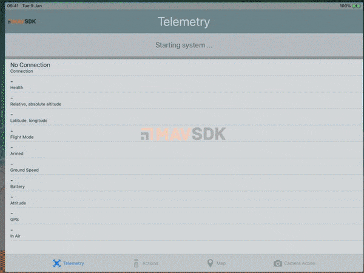

# Example app using MAVSDK on iOS



### Getting started

1. Create the Xcode project file from `project.yml` with [xcodegen](https://github.com/yonaskolb/XcodeGen) (that can be installed with Homebrew: `$ brew install xcodegen`):

```
xcodegen
```

2. Open `MAVSDK-Swift-Example.xcodeproj` with Xcode.
3. Set the signing team in the "General" tab of target `MAVSDK-Swift-Example`
